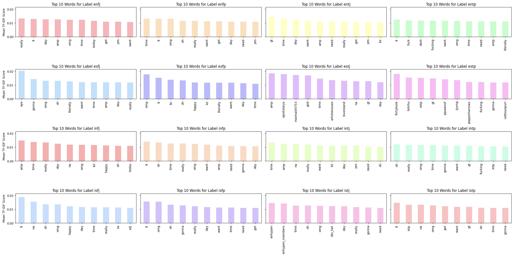

# CS5425_MBTI

This repository contains the code and resources for the study on predicting Myers-Briggs Type Indicator (MBTI) personality types using text mining techniques on Twitter data. The project explores the feasibility of using various machine learning models to classify tweets into one of the 16 MBTI categories or a simpler binary classification.

## Table of Contents

- [Introduction](#introduction)
- [Data](#data)
- [Data Preprocessing](#data-preprocessing)
- [Feature Engineering](#feature-engineering)
- [Model Exploration](#model-exploration)
- [Results](#results)
- [Catchphrase Visualization](#catchphrase-visualization)
- [Repository Structure](#repository-structure)
- [Contributing](#contributing)
- [License](#license)

## Introduction

The Myers-Briggs Type Indicator (MBTI) is a widely used personality assessment tool that categorizes individuals into 16 distinct personality types. This study aims to investigate the relationship between language use on Twitter and personality expression by predicting MBTI types using text mining techniques.

## Data

The dataset used in this study is located in the [data](data) directory. It contains Twitter data labeled with MBTI personality types.

## Data Preprocessing

The data preprocessing steps include:
- Stemming
- Stopword removal
- Other necessary cleaning and formatting

## Feature Engineering

The following feature engineering techniques were implemented:
- Word Embeddings
- TF-IDF

## Model Exploration

A range of machine learning models were utilized for the classification tasks:
- Logistic Regression (LR)
- Naïve Bayes
- Decision Trees
- LSTM
- BERT
- BLOOM

## Results

The performance of the models was evaluated on two classification tasks:
1. 16-category classification
2. 2-category (binary) classification

Detailed results and analysis can be found in the [results](results) directory.

## Catchphrase Visualization For 16 MBTI Types

## Repository Structure

The repository is structured as follows:

- [data](data): Contains the dataset used in the study.
- [images](images): Contains the catchphrase visualization images.
- [16category-LSTM.ipynb](16category-LSTM.ipynb): Notebook for 16-category classification using LSTM.
- [16category.ipynb](16category.ipynb): Notebook for 16-category classification using various models.
- [2category-LSTM.ipynb](2category-LSTM.ipynb): Notebook for 2-category classification using LSTM.
- [2category.ipynb](2category.ipynb): Notebook for 2-category classification using various models.
- [Bloom_560m_text_classification.py](Bloom_560m_text_classification.py): Script for fine-tuning the BLOOM model.
- [MBTI_Catchphrase.ipynb](MBTI_Catchphrase.ipynb): Notebook for catchphrase analysis.
- [MBTI_EDA.ipynb](MBTI_EDA.ipynb): Notebook for exploratory data analysis.
- [baseline.ipynb](baseline.ipynb): Notebook for baseline models.

## Contributing

Contributions to this project are welcome. Please follow the guidelines in [CONTRIBUTING.md](CONTRIBUTING.md) when submitting pull requests or issues.

## License

This project is licensed under the [MIT License](LICENSE).

